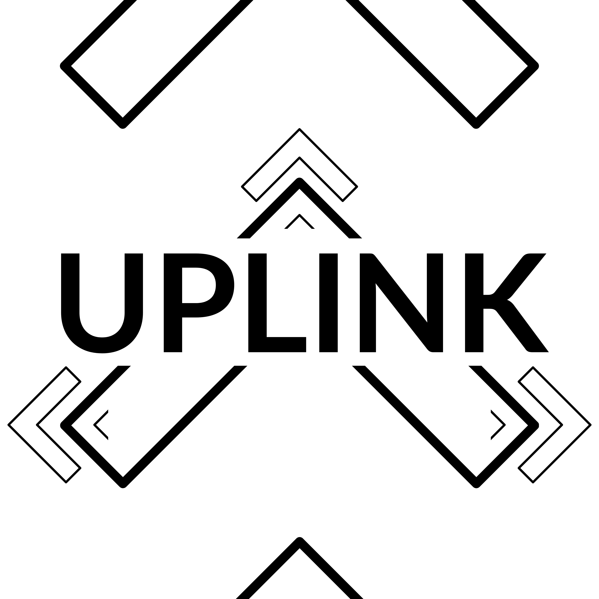
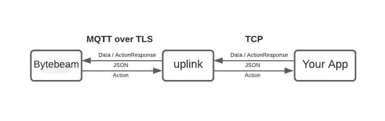

# uplink

[![Rust][workflow-badge]][workflow] [![@bytebeamio][twitter-badge]][twitter]



Uplink is a rust based utility for efficiently sending data and receiving commands from an IoT Backend. The primary backend for uplink is the [**Bytebeam**][bytebeam] platform, however uplink can also be used with any broker supporting MQTT 3.1.1.

### Features
- Efficiently send data to cloud with robust handling of flaky network conditions.
- Persist data to disk in case of network issues.
- Receive commands from the cloud, execute them and update progress of execution.
- Can auto download updates from the cloud to perform OTA firmware updates.
- Provides remote shell access through [Tunshell][tunshell]
- Supports TLS with easy cross-compilation.


### Quickstart

#### Install Uplink

Pre-built binaries for select platform targets have been made available in [releases], download the binary specific to your system and add it's location to PATH. You can also follow the [build guide].

#### Setup
You can start uplink with the following command, where you will need to provide an `auth.json` file:
```sh
uplink -a auth.json
```

The `auth.json` file must contain information such as the device's ID, the broker's URL, the port to connect to and the TLS certificates to be used while connecting as can be seen inside [dummy.json][dummy]. When connecting over non-TLS connections, authentication information is unncessary as illustrated by [noauth.json][noauth].


> **NOTE**: If you are using [Bytebeam][bytebeam], you could download the file downloaded [from the Bytebeam UI][platform]. If you are using your own broker instead, you could use uplink [without TLS][unsecure], but we recommend that you use TLS and [provision your own certificates][provision] to do it. You can read more about securing uplink in the [uplink Security document][security]

#### Configuring `uplink`
One may configure certain features of uplink with the help of a `config.toml` file by using the commandline arguments `-c` or `--config`:
```sh
uplink -a auth.json -c config.toml
```

It must be noted that parts of, or the entirety of the config file is optional and a user may choose to omit it, letting uplink default to configuration values that are compiled into the binary. uplink only expects the `config.toml` to contain configuration details as given in the [example config.toml][config] file in the configs folder.

#### Writing Applications
uplink acts as an intermediary between the user's applications and the Bytebeam platform/MQTT 3.1.1 broker of choice. One can accept [Action][action]s from the cloud and push data(from applications such as sensing) or [Action Response][action_response]s back.



**Receiving Actions**:
Actions are messages that uplink expects to receive from the broker and is executable on the user's device. The JSON format for Actions are as such:
```js
{
    "action_id": "...",
    "kind": "...",
    "name": "...",
    "payload": "..."
}
```
> **NOTE**: Some Actions are executed by built-in "collectors", e.g. Actions with `kind: process` and `kind: collector`. The tunshell action, i.e. Action with `name: tunshell` is used to [initiate a remote connection over tunshell](#Remote-Shell-Connection) while the OTA action, i.e. Action with `name: update_firmware` can [download OTA updates](#Downloading-OTA-updates).

**Streaming data**:
Data from the connected application is handled as payload within a stream. uplink expects the following JSON format for Streamed Payload:
```js
{
    "stream": "...",
    "sequence": ...,
    "timestamp": ...,
    // ...payload: more JSON data
}
```

An example data packet on the stream `"location"`, with the fields `"city"` being a string and `"altitude"` being a number would look like:
```js
{
    "stream": "location",
    "sequence": 10000000,
    "timestamp": 1987654,
    "city": "Bengaluru",
    "altitude": 123456,
}
```

> **NOTE**: uplink expects values for the `stream`, `sequence` and `timestamp` field to be properly set, the payload maybe as per the requirements of the IoT platform/application.

**Responding with Action Responses**:
Applications can use Action Response messages to update uplink on the progress of an executing Action. They usually contain information such as a progress counter and error backtrace. Action Responses are handled as Streamed data payloads in the "action_status" stream and thus have to be enclosed as such. uplink expects Action Responses to have the following JSON format:
```js
{
    "stream": "action_status",
    "sequence": ...,
    "timestamp": ...,
    "action_id": "...",
    "state": "...",
    "progress": ...,
    "errors": [...]
}
```

An example success response to an action with the id `"123"`, would look like:
```js
{
    "stream": "action_status",
    "sequence": 234,
    "timestamp": 192323,
    "action_id": "123",
    "state": "Completed",
    "progress": 100,
    "errors": []
}
```

#### Downloading OTA updates and other files
uplink has a built-in feature that enables it to download OTA firmware updates, this can be enabled by setting the following field in the `config.toml` and using the `-c` option while starting uplink:
```toml
[downloader]
actions = ["update_firmware"]
path = "/path/to/directory" # Where you want the update file to be downloaded
```
```sh
uplink -c config.toml -a auth.json
```

Once enabled, Actions with the following JSON will trigger uplink to download the file and hand-over the action to a connected application to perform the necessary firmware updation:
```js
{
    "action_id": "...",
    "kind": "process",
    "name": "update_firmware",
    "payload": "{
        \"url\": \"https://example.com/file\",
        \"version\":\"1.0\"
    }"
}
```
Once downloded, the payload JSON is updated with the file's on device path, as such:
```js
{
    "action_id": "...",
    "kind": "process",
    "name": "update_firmware",
    "payload": "{
        \"url\": \"https://example.com/file\",
        \"download_path\": \"/path/to/directory\",
        \"version\":\"1.0\"
    }"
}
```

#### Remote Shell Connection
With the help of tunshell, uplink allows you to remotely connect to a device shell. One can provide the necessary details for uplink to initiate such a connection by creating a tunshell action, with the following JSON format:
```js
{
    "action_id": "...",
    "kind": "...",
    "name": "tunshell",
    "payload": "{
        \"session\": \"...\",
        \"encryption\": \"...\"
    }"
}
```
> **NOTE**: Bytebeam has built-in support for tunshell, if you are using any other MQTT broker, you may have to manage your own tunshell server to use this feature.

### Testing with netcat

You can test sending JSON data to Bytebeam over uplink with the following command while uplink is active

```sh
nc localhost 5555
{ "stream": "can", "sequence": 1, "timestamp": 12345, "data": 100 }
{ "stream": "can", "sequence": 1, "timestamp": 12345, "data": 100 }
{ "stream": "can", "sequence": 1, "timestamp": 12345, "data": 100 }
```

The complete API reference for the uplink library is available within the [library documentation][docs.rs].

### Contributing
Please follow the [code of conduct][coc] while opening issues to report bugs or before you contribute fixes, also do read our [contributor guide][contribute] to get a better idea of what we'd appreciate and what we won't.


[build guide]: docs/build.md
[workflow-badge]: https://github.com/bytebeamio/uplink/actions/workflows/rust.yml/badge.svg
[workflow]: https://github.com/bytebeamio/uplink/actions/workflows/rust.yml
[twitter-badge]: https://img.shields.io/twitter/follow/bytebeamio.svg?style=social&label=Follow
[twitter]: https://twitter.com/intent/follow?screen_name=bytebeamio
[bytebeam]: https://bytebeam.io
[tunshell]: https://tunshell.com
[rumqtt]: https://github.com/bytebeamio/rumqtt
[crates.io]: https://crates.io/crates/uplink
[releases]: https://github.com/bytebeamio/uplink/releases
[action]: docs/apps.md/#Action
[action_response]: docs/apps.md/#ActionResponse
[security]: docs/security.md
[platform]: docs/security.md#Configuring-uplink-for-use-with-TLS
[unsecure]: docs/security.md#Using-uplink-without-TLS
[provision]: docs/security.md#Provisioning-your-own-certificates
[docs.rs]: https://docs.rs/uplink
[coc]: docs/CoC.md
[contribute]: CONTRIBUTING.md
[dummy]: configs/dummy.json
[noauth]: configs/noauth.json
[config]: configs/config.toml
[bytebeam]: https://bytebeam.io
