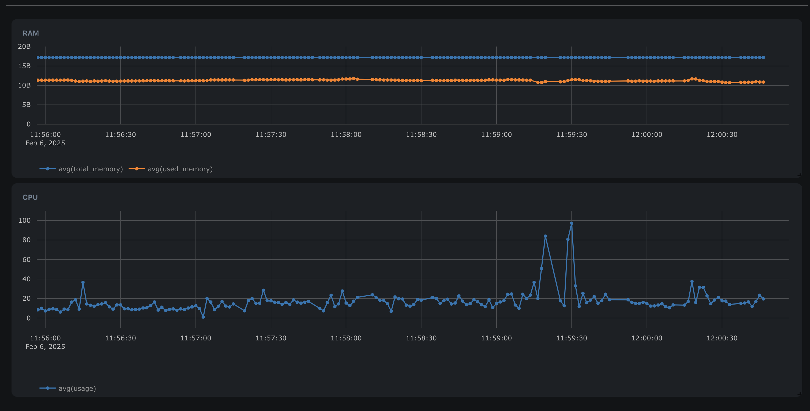

## Uplink quick start

This page is intended to get you up and running with uplink and bytebeam platform.

### Initial setup

---

Create a free account on https://cloud.bytebeam.io if you haven't already. After registering you will be prompted to create
a project. A project is where all your data will live. [This page](https://bytebeamio.mintlify.app/platform-guide/introduction) 
goes into the details of all the features. You can read it at your leisure but this page will also provide brief overview
of features needed to follow along.

---

The device management page has a create device button. Click on it, your browser will download a `device_1.json` file. Your devices
are supposed to use this file to connect to our platform. Each device you create on the dashboard is supposed to map to a unique physical device.
This file contains device private keys and the ca certificates, everything needed to securely connect to our backend.

--- 

Download the uplink executable for your platform from the [releases page](https://github.com/bytebeamio/uplink/releases) and start it by providing the `device.json` file as an argument:

```sh
./uplink -a device_1.json -v
```

Uplink will start and connect to our backend. You will notice a few changes in your device management page:

* The last heartbeat of the created device will change to `a few seconds ago`. This means that the device is live.
* You will see a value in the uplink version field in the overview of this device. Uplink is pushing its version along with the device shadow.
* You will be able to login to your device remotely using the `Remote shell` button. 

The uplink program is supposed to run as a background daemon on your device.

You can also configure the behavior of uplink using a toml configuration file like this:

```shell
./uplink -a device_1.json -c config.toml -v
```

### Monitoring

You have already seen some primitive form of monitoring during the setup described above (last heartbeat and uplink version). Here are some more ways you can monitor your
devices using our platform:

#### Linux system stats

Uplink can automatically collect system info like disk, network, cpu usage, memory usage, etc and upload it to our cloud.
You can visualize this info remotely using our dashboard, like a remote system monitor:



Line chart is one of several panel types. [See our documentation](https://bytebeamio.mintlify.app/platform-guide/dashboards/panels/introduction-to-panels) for detailed description of all available panels.

#### Logging

Uplink can also automatically collect journalctl (gnu linux) and logcat (android) logs and upload them to cloud for visualization using our logs panel. 
To enable log collection, add this to your config.toml file:

```toml
[logging]
tags = ["tag1", "tag2"]
min_level = 4 # must be between 0 (FATAL) and 6 (VERBOSE), 4 is info
```


#### Monitoring domain specific data

Till now we have shown you how to monitor generic system information (logs, system stats). Let's say you have an application
which is generating some data specific to your use case, that you want to be able to monitor remotely. Examples could be:

* Battery level of a wireless component
* Data being read from sensors
* GPS location of your device
* Number of connected users
* Firmware version of an IOT component

You can monitor and visualize this information remotely using our dashboards and panels. To do this you will need to create
a [stream](https://bytebeamio.mintlify.app/platform-guide/streams-tables/introduction-to-streams#introduction-to-streams-data-tables).
A stream is like a table in our backend, ordered by timestamp, to which you can push data remotely from your devices, and then
visualize using our portal. You've already seen examples of some streams that are created by default for you 
(device_shadow, uplink_system_stats for RAM, uplink_processor_stats for CPU usage). You can also create streams and push data to them manually using uplink. 

---

To do this, you will have to create something called a `tcpapp` in your uplink configuration. Add this to your `config.toml`:

```toml
[tcpapps.ui_app]
port = 8049
```

`ui_app` is just an identifier and could be anything. `port` is the tcp port on which you want uplink to listen for incoming connections.
One of your programs running on the same device can connect to this tcp port and write data to it, and it will be uploaded to our backend by uplink.

---

Say you created a stream called `motor_info` with these fields:
* `temperature` : Float32
* `rpm` : UInt32
* `vibrations` : Float32

You can connect to uplink over the declared tcp port and push data to it, one message per line, as json objects. This is how a message is supposed to look like:
```json
{"stream": "motor_info", "sequence": 5, "timestamp": 1738581618576, "temperature": 74, "rpm": 650, "vibrations": 0.31}
```
Individual messages should be written to the port separated by ascii newlines (`\n`).

Uplink will buffer and upload data to our cloud and then you can visualize it using our dashboards.

Uplink can also compress your data before uploading it if you want to save on network bandwidth. This compression has to be enabled
an a per stream basis. Eg. to enable compression for `motor_info` stream, add this to your config.toml:

```toml
[streams.motor_info]
compression = "Lz4"
```